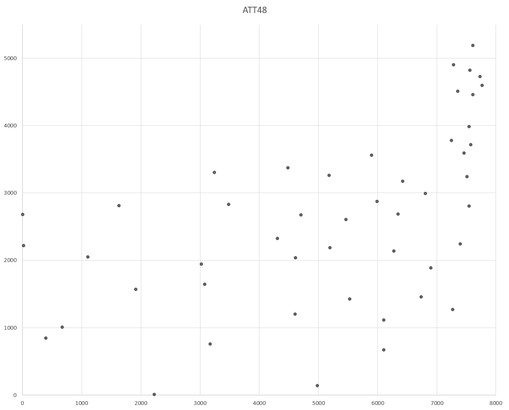
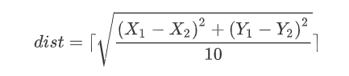

# TSP

> 旅行商问题(Traveling Salesman Problem，TSP)是一个经典的组合优化问题。经典的TSP可以描述为：一个商品推销员要去若干个城市推销商品，该推销员从一个城市出发，需要经过所有城市后，回到出发地。应如何选择行进路线，以使总的行程最短。

在本文中使用的数据为来自TSPLIB的`ATT48`，即美国本土48个州首府坐标，TSPLIB的已知最优解为10628。

从图论的角度来看，该问题实质是在一个带权完全无向图中，找一个权值最小的Hamilton回路。由于该问题的可行解是所有顶点的全排列，随着顶点数的增加，会产生组合爆炸，它是一个NP完全问题。

# 解决思路

由于NPC问题至今没有得到解决，TSP问题往往是通过启发式搜索（我觉得也可以叫暴力）算法来“猜”出最优解。

使用遗传算法来解决TSP问题，主要思路如下：

- 使用一个不重复的，首尾相同的字符串来表示一个解，该字符串即TSP的顺序
- 使用交叉，变异两种方式产生新的解，并根据数据来计算解的适应度
- 种群定义为当前所有解的一个集合，当种群中的每个个体完成一次“进化”（由概率决定）之后，称之为进化一代
- 对每一代种群进行筛选（根据适应度进行排序），择优劣汰，具有更优秀适应度的个体有更高的概率被其他个体选中进行交叉
- 不断重复上述过程，直到出现可以完全适应的个体（最优解）

遗传算法在TSP问题上可以融合多种算法，从而达到不同的效果，比如交叉应该如何交叉，变异应该如何变异等等。同时遗传算法的参数难以调整到最优——包括交叉率，变异率，种群容量等可以对搜索过程产生较大影响的参数都难以调整。限于个人水平，我无法从数学上给出最优参数，只能以经验论，加以多次实验选取表现优秀的样本。

# 解决方案

- 语言：C++

- 个体（解）的表示：用`vector`储存，代表节点遍历顺序

- 距离的计算：取伪欧式（pseudo Euclidean）距离，计算方法如下（向上取整）：

    

    使用`unordered_map`，内部实现为散列表，使得计算个体适应度可以达到*O*(N)​级别的复杂度

- 随机数的生成：设置时间种子，并由此生成随机数

- 交叉对象的选择：轮盘赌

- 交叉算法的选择：顺序移位

- 变异算法的选择：顺序移位 / 贪婪倒位

- 参数的选择：由多次实验得出

# Feature

- 种群自动扩增
- 贪心初始化
- 自动调整变异算子
- 自动调整变异率

**关于参数选择及其他方面的详细讨论请见**[遗传算法解决TSP问题](https://bipy.me/post/TSP-GA/).

# 实验记录

- 实验样本：ATT48@TSPLIB（`att48.tsp`）
- 理论最优解：10628
- 实验平台：CLion 2019.3（G++ 8.2.1 x64）

## 1000代

| 序号 | 最优解  | 耗时 / s |
| ---- | ------- | -------- |
| 0    | 12530   | 0.871    |
| 1    | 11965   | 1.061    |
| 2    | 12571   | 0.904    |
| 3    | 11974   | 0.84     |
| 4    | 12295   | 1.108    |
| 5    | 12528   | 0.793    |
| 6    | 12601   | 1.285    |
| 7    | 12505   | 0.82     |
| 8    | 11605   | 1.096    |
| 9    | 12410   | 0.901    |
| AVG  | 12298.4 | 0.9679   |

## 5000代

| 序号 | 最优解  | 耗时 / s |
| ---- | ------- | -------- |
| 0    | 10906   | 3.349    |
| 1    | 11122   | 3.899    |
| 2    | 11265   | 4.49     |
| 3    | 11591   | 5.184    |
| 4    | 11407   | 6.562    |
| 5    | 11282   | 6.531    |
| 6    | 10694   | 6.586    |
| 7    | 11141   | 6.311    |
| 8    | 11663   | 3.579    |
| 9    | 10968   | 7.298    |
| AVG  | 11203.9 | 5.3789   |

## 10000代

| 序号 | 最优解 | 耗时 / s |
| ---- | ------ | -------- |
| 0    | 10963  | 10.745   |
| 1    | 11278  | 12.68    |
| 2    | 11414  | 14.503   |
| 3    | 10879  | 26.493   |
| 4    | 11010  | 24.973   |
| 5    | 10969  | 37.576   |
| 6    | 11196  | 24.885   |
| 7    | 10977  | 24.884   |
| 8    | 11421  | 17.316   |
| 9    | 10673  | 17.068   |
| AVG  | 11078  | 21.1123  |